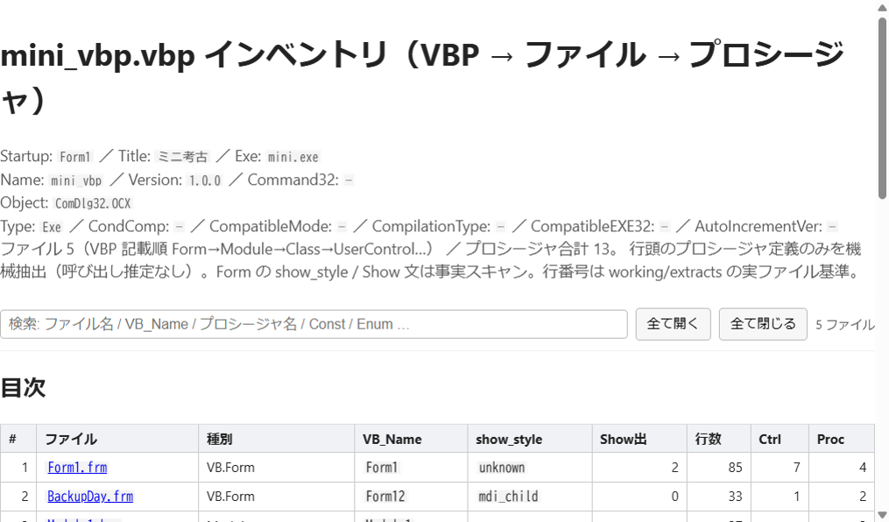

# vb6-archaeology

**[English](README.md)** · **[日本語](README.ja.md)**

[](https://github.com/suzukiosm/vb6-archaeology/actions/workflows/ci.yml)

**VB6 を壊さず理解するオペレーティングシステム** — 読取専用正本のまま、抽出・棚卸し・深読み・証拠つき理解までを再現可能にするキット。Python 3.10+、標準ライブラリのみ。

> **これは VB6 であり、VBA ではありません。** デスクトップの `.vbp` / `.frm` / `.bas` / `.cls` / `.ctl`。Office マクロでも VB.NET でも VBScript でもない。短い対比は [docs/vb6-not-vba.md](docs/vb6-not-vba.md)。



画面はフィクスチャ `mini_vbp`（日本語 Caption、CP932）。レポートは HTTP 経由（`file://` では開かない）。

## なぜあるか

コーディングエージェントは推測する。日本語 VB6 は多くの場合 **CP932** で、UTF-8 として読むと Caption も文字列も化ける。化けたままの callgraph は、存在しない画面を再実装させる。

このキットは変換器ではなく調査 OS である。

- 正本は読取専用（hooks が `source/` および `protected_source_dirs` への書込を拒否）
- 事実と推定を混ぜない。正規表現一括の callgraph は作らない
- レポートに書く名前は inventory に無くてはならない
- 「100%」はチェックリスト達成であり、アプリ全体の理解ではない

パーサライブラリより、現場考古学に近い: コピーを取り、そこにあるものを棚卸しし、証拠つきで読み、必要なら別リポで建て直す。

## 何ができるか

```text
.vbp（読取専用）
    → extract       working/extracts/<stem>/
    → inventory     ファイル・プロシージャ・Show 文面・VBP メタ
    → verify        End 数 / 名前集合 / show_style（コマンドは別）
    → deep-read     Form chrome と .bas/.cls 表面
    → layout        コード上の実行時座標
    → comprehend    証拠つき tick（人手 + 引用）
    → excerpt       再実装向けの短い HTML
```

入口は `python -m tools <command>`（`python -m tools --help`）。追加の pip 依存は無い。

## パーサでも VBA でも、書き換えでもない

| | 本キット | パーサ（例: [vb6parse](https://github.com/scriptandcompile/vb6parse), [ProLeap](https://github.com/uwol/proleap-vb6-parser)） | VBA ツール（例: Rubberduck） |
|---|---|---|---|
| 対象 | VB6 調査 + AI 手順 | 構文木 / CST | Office VBA |
| 正本 | 読取専用 + 書込拒否 hooks | その場でパース | 対象外 |
| 日本語ソース | CP932 を一級 | エンコーディングは利用者任せ | 別物 |
| 呼び出しグラフ | 作らない（Show 文面は列挙。推定しない） | あり得る | 対象外 |
| 成果 | inventory・skeleton・証拠 tick | AST | IDE 検査 |

AST が必要ならパーサを使う。正本を壊さず、エージェントに辺を発明させたくないときに本キットを使う。

## 5 分で動かす

```powershell
cd <this-repo>
python -m tools fixture
python -m tools extract "source\mini_vbp\mini_vbp.vbp"
python -m tools inventory working\extracts\mini_vbp
python -m tools verify working\reports\mini_vbp_inventory.json
python -m tools status
python -m tools deep-read Form1.frm --extract working\extracts\mini_vbp
python -m tools layout --extract working\extracts\mini_vbp
python -m tools excerpt
python -m tools serve
```

`http://127.0.0.1:8765/`（目次）、inventory HTML、`/excerpt` を開く。

自己点検（パイプライン + テスト）:

```powershell
python -m tools smoke
# 消費者リポで業務テストを足しているとき、キット層だけ:
# python -m tools smoke --kit-only
```

## エンコーディング（CP932）

日本語 VB6 は **UTF-8 ではない**。Cursor の Read は日本語を化かすことがある。化けた文字を引用根拠にしない。内容判断は `python -m tools lines` かキットのツール経由。

詳細: [日本語](docs/encoding-cp932.md) · [English](docs/en/encoding-cp932.md)

## AI エージェントへ

1. **[AGENTS.md](AGENTS.md)** を Read
2. 続けて **[docs/ai-onboarding.md](docs/ai-onboarding.md)** を Read（必須）
3. 作業は commands（`/vb6-extract` 等）または対応 skill から入る
4. 正本 `source/`（および設定された保護ディレクトリ）には書かない

グローバルな Cursor ルールには依存しない（Python 3.10+ とこのリポだけで完結）。

## ドキュメント

| | English | 日本語 |
|---|---|---|
| このランディング | [README.md](README.md) | [README.ja.md](README.ja.md) |
| 文書ハブ | [docs/en/README.md](docs/en/README.md) | [docs/README.md](docs/README.md) |
| VB6 ≠ VBA | [docs/en/vb6-not-vba.md](docs/en/vb6-not-vba.md) | [docs/vb6-not-vba.md](docs/vb6-not-vba.md) |
| 他リポへの採用 | [docs/en/adopting-in-a-project.md](docs/en/adopting-in-a-project.md) | [docs/adopting-in-a-project.md](docs/adopting-in-a-project.md) |
| 貢献 | [CONTRIBUTING.md](CONTRIBUTING.md) | （同ファイル・二言語） |

再実装の製品面: [docs/reimplementation-handoff.md](docs/reimplementation-handoff.md)（調査完了 ≠ UI 完了）。

## レイアウト

```
source/                 # 読取専用 VB6 正本（hooks 保護）
working/extracts/       # 切り出しコピー
working/reports/        # 調査成果
working/skeletons/      # Form skeleton JSON
tools/                  # 再利用 CLI（python -m tools）
docs/                   # 方法論・採用ガイド・テンプレ
docs/en/                # 英語の公開ドキュメント
docs/assets/            # README 用画面（フィクスチャ）
schema/                 # archaeology.config.json の JSON Schema
.cursor/                # rules / skills / commands / hooks
archaeology.config.json # 保護 dir・出力先・layout hints（mdi_chrome 等）
```

## 他リポへの採用

**事前許諾が必要**（[LICENSE](LICENSE)）。許諾後の手順は [docs/adopting-in-a-project.md](docs/adopting-in-a-project.md)。  
最小セット: `tools/` + `.cursor/` + `schema/` + `archaeology.config.json` + `AGENTS.md` 雛形。

閲覧と学習のための参照は歓迎します。

## License

See [LICENSE](LICENSE).
