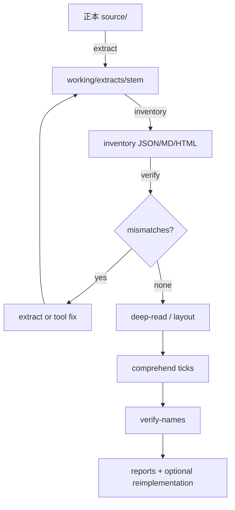

# 標準ワークフロー

すべて `python -m tools <command>` から実行する（一覧は `python -m tools --help`）。

## 全体図



## Step 0 — 設定を確かめる

```powershell
python -m tools config-check
```

`protected_source_dirs` が実際の正本ツリー名と一致しているかをここで潰す。

## Step 1 — 正本を置く

1. VB6 ツリーを `source/<project>/` に置く（または `archaeology.config.json` の保護名）
2. 対象 `.vbp` パスを確定
3. **正本は触らない**

## Step 2 — 抽出 (`/vb6-extract`)

```powershell
python -m tools extract "source\<project>\<Name>.vbp"
```

確認:

- `_extract_report.json` の `missing` が空
- `skipped_ref_count` は COM `Reference=`（コピー対象外・正常）

## Step 3 — インベントリ (`/vb6-inventory`)

```powershell
python -m tools inventory working\extracts\<stem>
python -m tools verify working\reports\<stem>_inventory.json
```

これが構成把握の正。以降のレポートはここの名前集合に従う。

## Step 4 — Form 深読み (`/frm-deep-read`)

優先順の例:

1. Startup フォーム（VBP `Startup=`）
2. 規模上位の `.frm`
3. Show される子フォーム

```powershell
python -m tools deep-read <File>.frm --extract working\extracts\<stem>
python -m tools deep-read-all --extract working\extracts\<stem>
```

## Step 5 — 実行時座標 (`/runtime-layout`)

```powershell
python -m tools layout --extract working\extracts\<stem>
```

デザイナ値（Step 4）と実行時代入（Step 5）は別レイヤ。**両方見るまで座標を確定しない**。

## Step 6 — 理解 tick (`/vb6-comprehend`)

1 tick = 主要プロシージャ 1 つの精読 + 証拠つき追記。

```powershell
python -m tools comprehend                                   # 骨格（初回のみ）
python -m tools comprehend --add-tick <Proc>[@<File>] --layer C
```

inventory に無い名前は拒否される。拒否されたら名前を疑う（手書きで押し通さない）。

層モデル:

| 層 | 内容 |
|---|---|
| A | 静的構造（inventory） |
| B | データ契約（ファイル/MDB/独自 DAT） |
| C | UI / モード変数 / 遷移 |
| D | 外部 EXE・COM・ネットワークパス |
| E | 関連 VBP との境界 |

## Step 7 — 報告書と照合 (`/vb6-report` · `/vb6-verify-reports`)

事実節と推定節を分離。訂正時は参照元をカスケード更新。書いたら照合する:

```powershell
python -m tools verify-names --inventory working\reports\<stem>_inventory.json
```

閲覧は `python -m tools serve`（`file://` は使わない）。

## Step 8 —（任意）再実装

消費者リポの作業。本キットは skeleton / runtime-layout JSON を中間成果として渡す。  
実装に入る前に「確定事実」であることを再検証する。

## 停止条件

- 合意したチェックリスト達成
- ユーザーが「止め」と明示
- 正本や外部データの不足で証拠が取れない（その時点で報告して待つ）
