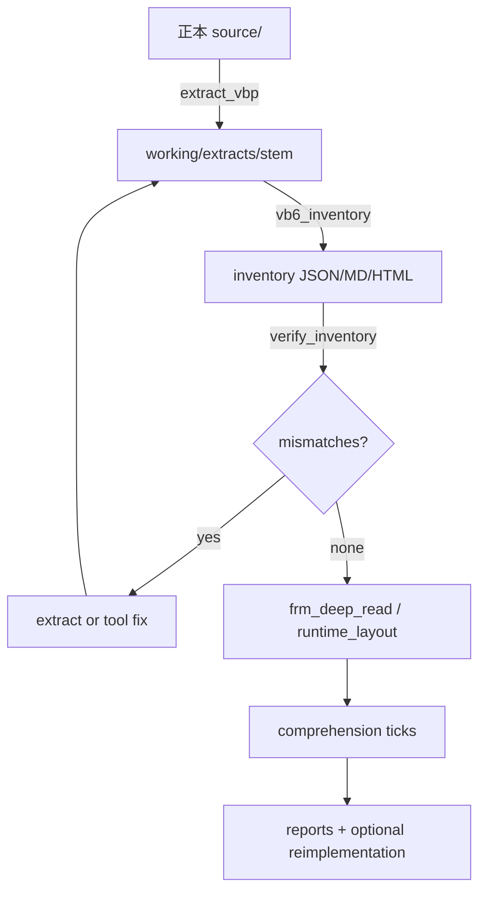

# 標準ワークフロー

## 全体図



## Step 1 — 正本を置く

1. VB6 ツリーを `source/<project>/` に置く（または `archaeology.config.json` の保護名）
2. 対象 `.vbp` パスを確定
3. **正本は触らない**

## Step 2 — 抽出 (`/vb6-extract`)

```powershell
python tools/extract_vbp.py "source\<project>\<Name>.vbp"
```

確認:

- `_extract_report.json` の `missing` が空
- `skipped_ref_count` は COM `Reference=`（コピー対象外・正常）

## Step 3 — インベントリ (`/vb6-inventory`)

```powershell
python tools/vb6_inventory.py working\extracts\<stem>
python tools/verify_inventory.py working\reports\<stem>_inventory.json
```

これが構成把握の正。以降のレポートはここの名前集合に従う。

## Step 4 — Form 深読み (`/frm-deep-read`)

優先順の例:

1. Startup フォーム（VBP `Startup=`）
2. 規模上位の `.frm`
3. Show される子フォーム

```powershell
python tools/frm_deep_read.py <File>.frm --extract working\extracts\<stem>
python tools/runtime_layout.py --extract working\extracts\<stem>
```

## Step 5 — 理解 tick (`/vb6-comprehend`)

1 tick = 主要 Sub 1 つの精読 + 証拠つき追記。

層モデル:

| 層 | 内容 |
|---|---|
| A | 静的構造（inventory） |
| B | データ契約（ファイル/MDB/独自 DAT） |
| C | UI / モード変数 / 遷移 |
| D | 外部 EXE・COM・ネットワークパス |
| E | 関連 VBP との境界 |

## Step 6 — 報告書 (`/vb6-report`)

事実節と推定節を分離。訂正時は参照元をカスケード更新。

## Step 7 —（任意）再実装

消費者リポの作業。本キットは skeleton / runtime-layout JSON を中間成果として渡す。  
実装に入る前に「確定事実」であることを再検証する。

## 停止条件

- 合意したチェックリスト達成
- ユーザーが「止め」と明示
- 正本や外部データの不足で証拠が取れない（その時点で報告して待つ）
